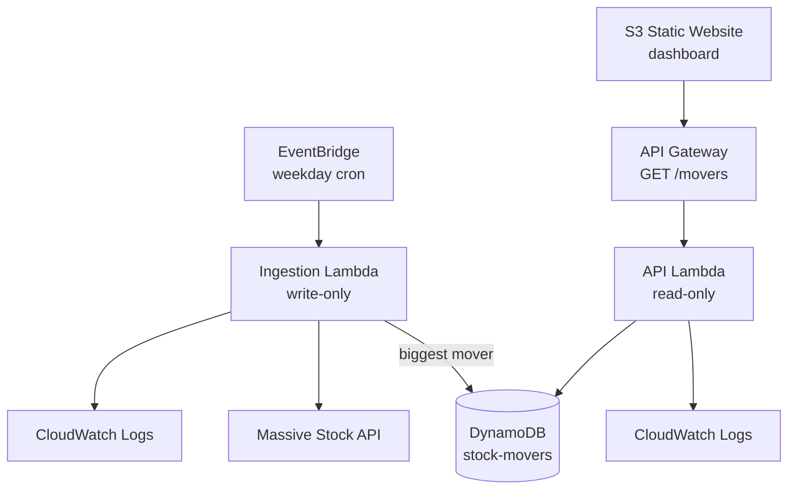

# Stocks Serverless Pipeline

[](https://github.com/Brundachagari/stocks-serverless-pipeline/actions/workflows/ci.yml)

A fully automated, serverless AWS pipeline that wakes up every weekday, finds the
single biggest mover in a tech-stock watchlist, stores the winner, and serves a
7-day history through a public dashboard. All infrastructure is defined in
Terraform and runs comfortably inside the AWS Free Tier.

**Live dashboard:** http://stock-movers-dashboard-556183271380.s3-website-us-east-1.amazonaws.com
**Live API:** https://86sc0f21kk.execute-api.us-east-1.amazonaws.com/movers

```bash
curl https://86sc0f21kk.execute-api.us-east-1.amazonaws.com/movers
```

---

## Project goal

Design, deploy, and document a serverless stock-data pipeline using AWS Free Tier
resources. The watchlist is:

```text
AAPL, MSFT, GOOGL, AMZN, TSLA, NVDA
```

For each trading day, the ingestion Lambda pulls the open and close prices for each
ticker, calculates the percentage change, and picks the stock with the **largest
absolute movement** — a big drop can beat a smaller gain.

```text
Percentage change = ((close - open) / open) * 100

AAPL: +1.20%
TSLA: -4.10%
NVDA: +2.70%

Winner: TSLA, because |-4.10| is the largest absolute move.
```

---

## Architecture



The project is split into two independent backend responsibilities:

- **Ingestion logic** runs on a schedule, fetches stock data, calculates the daily
  winner, and stores the result.
- **Retrieval logic** serves stored results to the frontend through a REST API.

The two Lambdas have **separate, least-privilege IAM roles** — the ingestion
function can only *write* to DynamoDB, the API function can only *read*. Public read
traffic can never reach the write path, which keeps the scheduled job fully
independent from the website's API.

---

## AWS services used

| Service | Role in the pipeline |
| --- | --- |
| **AWS Lambda** | Runs the ingestion and API backend logic |
| **Amazon EventBridge** | Triggers the ingestion Lambda on a schedule |
| **Amazon DynamoDB** | Stores daily stock-mover results (one row per day) |
| **Amazon API Gateway** | Exposes the `GET /movers` endpoint |
| **Amazon S3** | Hosts the static frontend website |
| **AWS IAM** | Scopes per-Lambda permissions to exactly what each needs |
| **Amazon CloudWatch Logs** | Provides logging and debugging visibility |
| **Terraform** | Defines and deploys all infrastructure as code |

---

## How the pipeline works

1. **EventBridge** triggers the ingestion Lambda on a daily schedule.
2. The Lambda loops through the watchlist and requests each ticker's daily data from
   the **Massive** API.
3. It calculates the percentage change from open to close for each ticker.
4. It selects the stock with the **largest absolute** percentage move.
5. The result is stored in **DynamoDB** with the date, ticker, percent change, and
   closing price.
6. **API Gateway** exposes `GET /movers`; the API Lambda reads recent records from
   DynamoDB and returns them as JSON.
7. The **S3 frontend** calls the API and renders the recent winners in a chart and table.

---

## API design

### `GET /movers`

Returns recent stock-mover records, newest first.

```json
{
  "count": 2,
  "limit": 7,
  "movers": [
    { "date": "2026-06-22", "ticker": "AMZN", "percent_change": -3.04, "closing_price": 232.79 },
    { "date": "2026-06-18", "ticker": "AMZN", "percent_change": 1.78, "closing_price": 244.39 }
  ]
}
```

| Field | Meaning |
| --- | --- |
| `count` | Number of records returned |
| `limit` | Requested (or default) record limit |
| `movers` | The actual stock-mover data |

### `GET /movers?limit=N`

The endpoint accepts an optional `limit` query parameter. The default is **7**
records, and the maximum is capped at **30** so the API can't be asked for an
unreasonable amount of data.

```bash
curl "https://86sc0f21kk.execute-api.us-east-1.amazonaws.com/movers?limit=3"
```

The API also sets response headers for CORS, JSON formatting, short-lived caching,
and debugging.

---

## Frontend

A static HTML/CSS/JavaScript dashboard hosted on S3. It displays:

- the biggest recent mover,
- a bar chart of daily percentage changes,
- a table of recent winner records,
- green/red color coding for gains and losses,
- a visible data-source label showing when the dashboard is reading the live API.

The frontend is intentionally lightweight. A full React or Next.js app would work,
but for this challenge a static page is faster to deploy, cheaper to host, and still
demonstrates the full pipeline clearly — and the brief explicitly weights robust
architecture over a "pretty" UI.

---

## Repository structure

```text
stocks-serverless-pipeline/
├── frontend/
│   └── index.html                # static dashboard (Chart.js, no build step)
├── lambdas/
│   ├── api/
│   │   └── lambda_function.py     # GET /movers: read recent winners from DynamoDB
│   └── ingestion/
│       └── lambda_function.py     # scheduled: fetch, find, and store the daily winner
├── scripts/                       # local-only helpers for testing the API
├── terraform/
│   ├── api_gateway.tf
│   ├── dynamodb.tf
│   ├── frontend.tf
│   ├── lambda_api.tf
│   ├── lambda_ingestion.tf
│   ├── outputs.tf
│   └── provider.tf
├── .github/workflows/ci.yml       # validates Terraform + Lambda syntax on every push
├── .gitignore
├── README.md
└── requirements.txt
```

---

## Infrastructure as code

All AWS resources are managed with Terraform — no manual AWS Console clicking for any
deployed infrastructure. Terraform defines the S3 frontend hosting, both Lambda
functions, the DynamoDB table, the API Gateway route, the EventBridge schedule, the
IAM permissions, and the outputs.

```bash
cd terraform
terraform init
terraform fmt
terraform plan
terraform apply
```

After `apply`, Terraform prints the live API URL and frontend URL as outputs.

---

## Security

- **No API keys in the repo.** The Massive API key is passed into the deployed
  environment through a Terraform variable marked `sensitive` — never hardcoded into
  Lambda source or committed to GitHub.
- **Least-privilege IAM.** Each Lambda's role is scoped to only the resources it
  needs: write-only DynamoDB access for ingestion, read-only for the API.
- **Minimal public surface.** API Gateway only exposes the read endpoint the frontend
  needs; CORS is enabled for that access.
- **Nothing sensitive in git.** `.env`, `.tfvars`, `.auto.tfvars`, Terraform state
  files, and Lambda zip artifacts are all `.gitignore`d so credentials and local
  build files never land in the repo.
- **Infrastructure managed by Terraform** rather than manual changes, so every
  permission and resource is reviewable in code.

---

## Error handling and robustness

The API Lambda includes safeguards for common issues:

- applies a sensible default record limit,
- validates malformed `limit` query parameters,
- caps oversized `limit` requests,
- converts DynamoDB `Decimal` values into JSON-safe numbers,
- returns a clear error message if data can't be retrieved,
- sets CORS headers so the frontend can call the API safely.

For the current scale, the API Lambda scans the DynamoDB table and sorts records in
memory. That's acceptable here because the table stores only one winner per day, so
the dataset stays small. At production scale (years of records), the right move is a
date-based query or a secondary index instead of a scan.

---

## Design trade-offs

- **Static frontend instead of React.** The challenge is about the serverless data
  pipeline, not frontend complexity, so a plain static page keeps it easy to deploy
  and review.
- **DynamoDB scan for retrieval.** One record per day means a scan is simple and cheap
  at this scale; a larger dataset would justify a query-first table design.
- **One daily winner per date.** Storing only the single largest mover keeps the table
  small and focused on the dashboard's requirement, rather than every raw response.
- **`limit` parameter, default 7.** The challenge asks for recent history, so the API
  defaults to 7 records but accepts a `limit` for flexibility without frontend changes.

---

## Local development

```bash
git clone https://github.com/Brundachagari/stocks-serverless-pipeline.git
cd stocks-serverless-pipeline
pip install -r requirements.txt
```

For local stock-API testing, create a `.env` file (never commit it):

```text
STOCK_API_KEY=your_key_here
```

---

## Possible next steps

- Move the API key into **AWS Secrets Manager** so it's absent from both the Lambda
  config and Terraform state.
- Add a **CloudWatch alarm → SNS email** on ingestion errors.
- Extend the GitHub Actions workflow to **`terraform apply` on merge** for full CI/CD.
- Migrate to a **remote Terraform state backend** (S3 + DynamoDB lock) for team-safe
  collaboration.